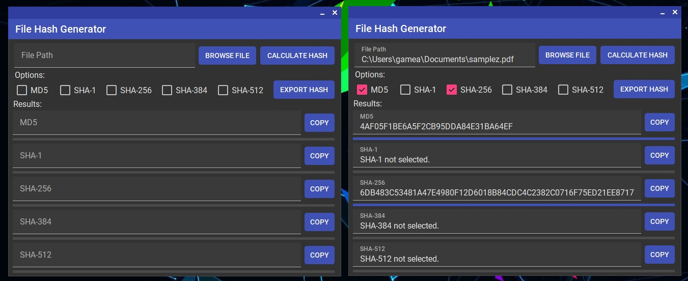

# File Hash Generator
A material designed tool that generates selected hashes from a selected file. Supports MD5, SHA-1, SHA-256, SHA-384, and SHA-512.

# Status

Currently ready for release.

Version: Stable-1.0.0

# Bugs

None! or You tell me :stuck_out_tongue:

# Preview

# Credits

[Icons8]("https://icons8.com/icons/set/hashtag-activity-feed") for the app icon and [leocb]("https://github.com/leocb/MaterialSkin") for the MaterialSkin.

